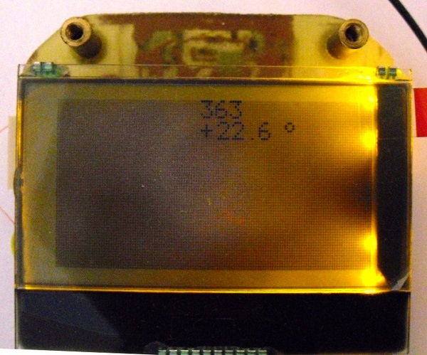

<h2>Подключение дисплея RDX0154 к микроконтроллеру atmega88, STM32F051R8T6.</h2>

Вашему вниманию представлена библиотека позволяющая работать с графическим индикатором RDX0154. Дисплей позволяет отображать 132x64 точки. Данная библиотека была портирована из atmega88 проекта (в исходниках есть пример панели спидометра для скутера). 
<a href ="https://github.com/SundayRosin/UniversalProjects">Печатная плата</a> 
Библиотека написана 22.10.2015

Описание примеров:

Lab1 - мигание светодиодами на отладочной плате. 

Lab2 - рисование фигур на экране. 
 

Lab3 - вывод текста на экран. 
 

Lab4 - измерение температуры. 
 
 

Lab5 - измерение напряжения. 
 
 

<a href ="./Doc/Лабораторные работы.docx">Описание в формате .doc</a>

